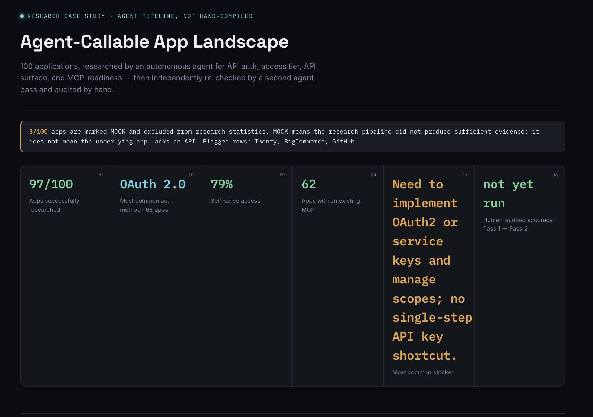
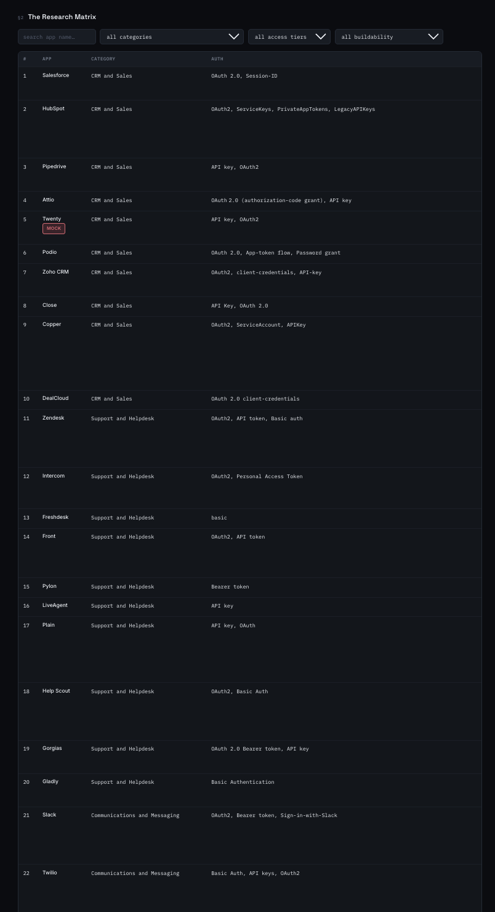
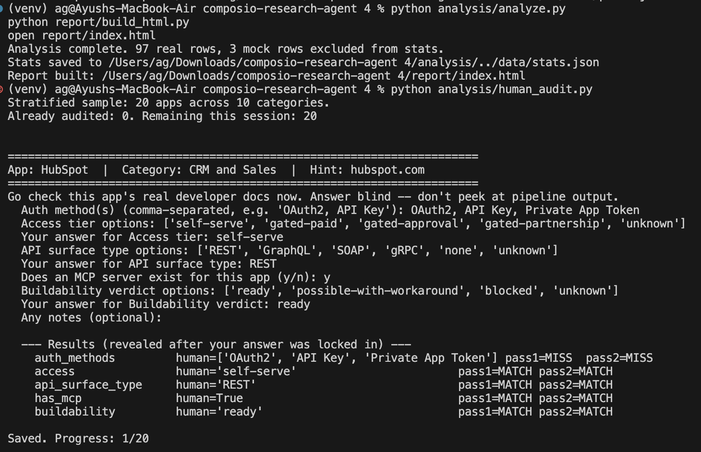

# Agent-Callable App Landscape — Research Pipeline

A comprehensive research pipeline designed to evaluate 100 applications for their API authentication methods, access tiers, API surfaces, and MCP (Model Context Protocol) readiness. 

This project utilizes an autonomous agent pipeline (powered by LangChain, LangGraph, and Groq) coupled with the Composio and Exa toolsets for automated data gathering. It goes beyond automated extraction by implementing an independent verification pass and a blind, stratified human audit to ensure data accuracy.

## 🏗 Architecture & Data Flow

```text
data/apps.json                 The initial 100-app input list
  │
  ▼
research/research_agent.py     Pass 1: Composio/Exa search → structured extraction
  │                             → data/pass1.jsonl
  ▼
research/verify_agent.py       Pass 2: independent fresh search + citation
  │                             fetch-check → data/pass2.jsonl
  ▼
analysis/human_audit.py        Blind, stratified human audit (2 apps/category)
  │                             → data/audit_results.json
  ▼
analysis/analyze.py            Pattern clustering + accuracy delta
  │                             → data/stats.json
  ▼
report/build_html.py           Renders report/template.html → report/index.html
                                 (The final deliverable report)

live-demo/app.py               Standalone FastAPI endpoint the report page
                                 calls live so a reviewer can trigger a fresh
                                 research run on any app name.
```


## 🚀 Setup & Installation

1. **Environment Setup**
  ```bash
   python -m venv venv
   source venv/bin/activate
   pip install -r requirements.txt
  ```
2. **Configuration**
  ```bash
   cp .env.example .env
  ```
   Fill in your `GROQ_API_KEY` and `COMPOSIO_API_KEY` in the `.env` file.
  > **Note:** The Python SDK automatically creates a scoped Exa session. Ensure your Composio API key has `Sessions -> Write` permission and that the Exa toolkit is enabled in your Composio project.

If `COMPOSIO_API_KEY` isn't set, the pipeline will still run end-to-end but return mocked responses (`is_mock: true`). This allows you to validate the pipeline plumbing (schema, checkpointing, report rendering) without consuming real API credits. Mock rows are excluded from statistics and visibly flagged in the final report.

## 📸 Screenshots


### Agent Pipeline



### **Research Results** — [For full results, view the complete report]([https://drive.google.com/file/d/1o1Sw1_smNvUzDL8-q_GK6GhUudRPejDl/view?usp=sharing](https://drive.google.com/file/d/1o1Sw1_smNvUzDL8-q_GK6GhUudRPejDl/view?usp=sharing))



## Human Audit



## ⚙️ Running the Pipeline

You can run the pipeline stages sequentially as follows:

```bash
# 1. Pass 1 — Initial research (Checkpoints saved to data/pass1.jsonl, resumable)
python research/research_agent.py --limit 100

# 2. Pass 2 — Independent verification (Checkpoints saved to data/pass2.jsonl, resumable)
python research/verify_agent.py --limit 100

# 3. Human audit — Blind, stratified verification (2 apps per category).
# Note: You will be prompted in the terminal. Please consult real docs before answering.
python analysis/human_audit.py

# 4. Pattern analysis + accuracy delta computation
python analysis/analyze.py

# 5. Build and view the HTML report
python report/build_html.py
open report/index.html
```


### Smoke Testing

We recommend smoke-testing the pipeline on a small subset of apps before executing the full 100-app run:

```bash
python research/research_agent.py --limit 5
python research/verify_agent.py --limit 5
```


### Live Demo Endpoint

To start the standalone FastAPI backend for real-time demo functionality:

```bash
uvicorn live-demo.app:app --reload --port 8000
```

For production deployment (Render/Railway/Fly), refer to the `live-demo/app.py` header for quick start commands. After deploying, update the `DEMO_API_URL` variable inside `<script>` in `report/template.html` and rebuild the report.

## 🧑‍💻 Human-in-the-Loop Methodology

To ensure high data integrity, this pipeline deliberately integrates human validation at critical junctures:

1. **Pattern Insights**: Actionable insights in the report (`report/template.html`) are curated by hand based on the raw statistical data (`data/stats.json`). This ensures genuine analytical depth rather than relying on LLM-regurgitated statistics.
2. **Blind Audit**: The 20-app audit (`analysis/human_audit.py`) is conducted entirely manually. Auditors refer to live documentation and provide answers before seeing the agent's output, eliminating anchoring bias.
3. **Disagreement Resolution**: Any discrepancies between Pass 1 and Pass 2 (that aren't part of the stratified audit) are spot-checked and resolved manually before finalizing `data/pass2.jsonl`.


## 📊 Accuracy Metrics

The accuracy metrics presented in this project represent measured real-world performance, not self-reported confidence scores. 

`analysis/human_audit.py` samples 2 apps per category (20 total), prompting the human auditor for answers before revealing the agent's findings. This generates two independent performance metrics: `pass1_field_accuracy_pct` and `pass2_field_accuracy_pct`. These are surfaced as the primary "Pass 1 → Pass 2" delta in the final HTML report.

## ⚠️ Known Limitations

- Verification Pass 2 focuses strictly on structured fields (auth, access, API surface, MCP readiness). Free-text fields (e.g., `one_liner`, `blocker`) are excluded from automatic diffs.
- The human audit covers 100 data points (5 fields × 20 apps), providing a meaningful, stratified baseline without requiring thousands of manual checks.
- Applications gated behind partnership or paid access are accurately flagged as such; this is an intended finding, not a pipeline failure.
- Fully failed rows (`is_mock: true`) are excluded from general statistics and explicitly listed in the report banner rather than being silently discarded.

